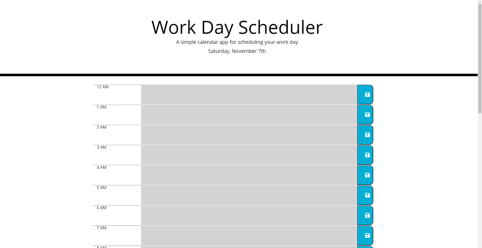

# Scheduler-App

This project is a simple day planner for employees with a busy schedule who want a daily planner to add events to so they can manage their time effectively. The user is presented with a schedule sheet with the current day posted and 24 time blocks with each hour of the day which that can enter important events into. When the user clicks a save button, their entire schedule is saved in local storage, so they can come back and view/edit their schedule whenever they like.

## Features

### Moment.js

Moment.js has been implemented to ensure accurate day and time information. When the page is loaded, the current day will be displayed at the top and a function is called to determine the current time, assigning each time block a past, present, or future state. Past hours will be light gray, the present hour will be red, and future hours will green.

### Easy Save

As an employee with a busy schedule, you want saving to be easily accessible for when you need make quick changes and go. The easy save method feautes save buttons on each time block that not only save your event in that hour, but the events of every other hour in your schedule, so no matter where you are on the page, saving your whole day is just a button click away.

### Local Storage

Whenever you click a save button, your entire schedule is saved to local storage on your machine so you can come back and view/edit your schedule anytime without fear of losing your important events.

## Credits
https://getbootstrap.com/
 
https://fontawesome.com/
 
https://fonts.google.com/
 
https://code.jquery.com/
 
https://momentjs.com/

## Link
https://tchristensendrumz.github.io/Scheduler-App/
